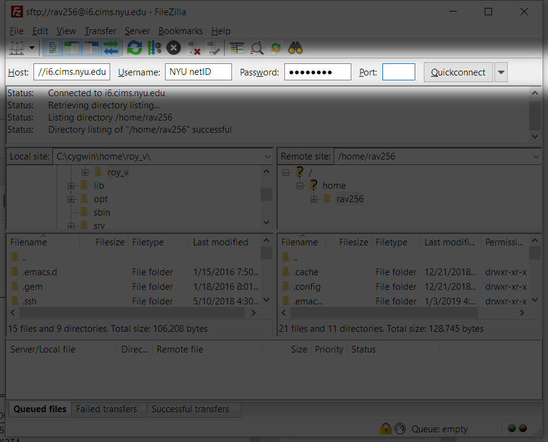
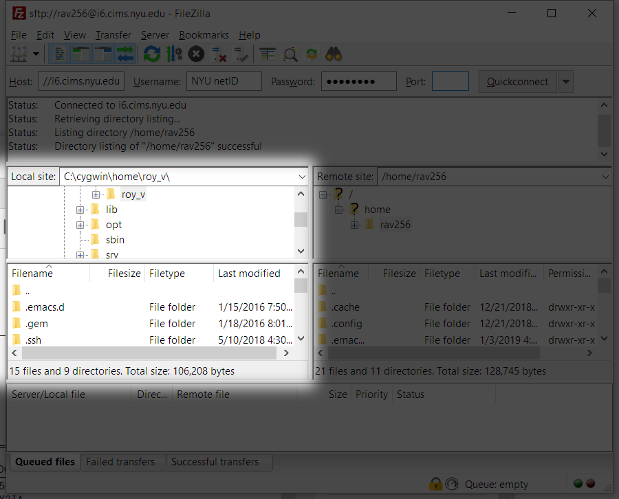
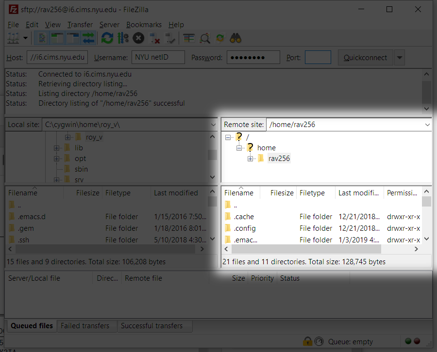
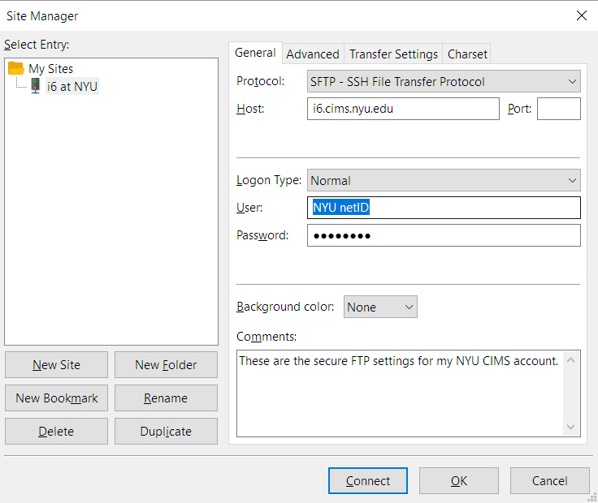
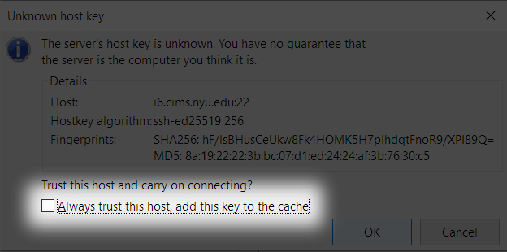

# Using Filezilla with NYU’s i6 Server
[FileZilla](https://filezilla-project.org/download.php?type=client) is an open-source FTP client for Mac, Windows, and Linux. Use the following settings to connect to your i6 account on CIMS.

| Item           | Value                    |
|---------------:|:-------------------------|
| **_Host_**     | `sftp://i6.cims.nyu.edu` |
| **_Username_** | `NYU netID`              |
| **_Password_** | `i6 password`            |
| **_Port_**     | `22`                     |

---

## Quickconnect
In the initial page, use the credentials from the table above to connect using the row of text boxes along the top of FileZilla’s Quickconnect page.

Once you’re connected, the lower left pane represents your computer’s file system.

The lower right pane represents your i6 account’s file system.

You can copy files and folders between your computer and your i6 account by dragging and dropping them between the left and right panes.

---

## Saving Settings in Site Manager
You can save all your settings in FileZilla’s Site Manager in order to easily connect to your i6 account. Type `⌘ + S` on a Mac, `cntrl + S` in Windows to launch Site Manager. Use the following screenshot as a guide for your own settings. Refer to the steps at the bottom of the screenshot for more details.

1. In the grid of buttons along the lower left corner, choose `New Site`, then name the site.
2. Set `Protocol` to `SFTP - SSH File Transfer Protocol` for the `Protocol`.
3. Set `Host` to `i6.cims.nyu.edu`.
4. Set `Logon Type` to `Normal`
5. Set `User` to your NYU netID.
6. Set `Password` to your i6 CIMS password.
7. Set an optional comment.
8. Click `Connect`.

Finally, you’ll be asked if you’d like to trust the i6 host. Click the `Always trust this host, add this key to the cache` checkbox, then click `OK`.
